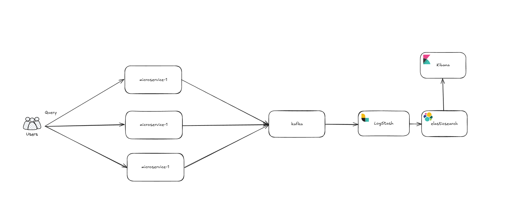
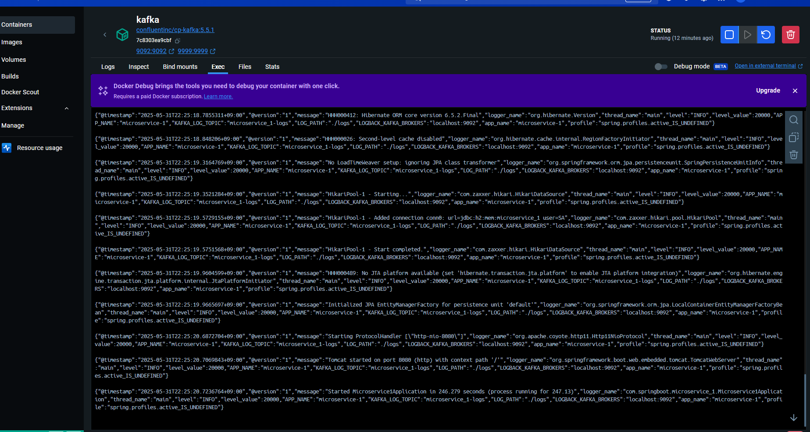
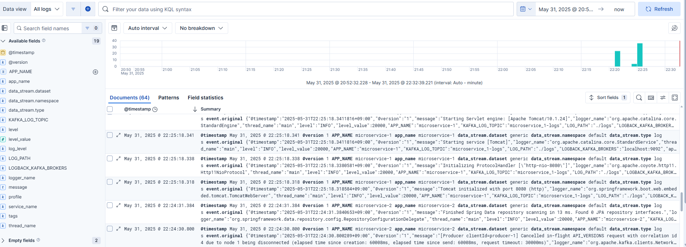

# MicroService-Log-Practice
각 서비스로부터의 로그를 카프카를 통해서 elk로 집계하는 예시 프로젝트 입니다.

## 아키텍처

- 유저의 요청을 받아서 각 서비스에서 logback 설정을 통해서 카프카로 로그를 전송한다.
- 이후 전송된 로그는 각 서비스의 logstash 설정 파일로 카프카의 로그를 logstash로 전송
- 전송된 로그는 elasticsearch에 저장되며 저장된 로그를 통해서 키바나로 막대그래프 출력

## 카프카 컨슈머

- 각 서비스로부터 받은 로그 카프카로 확인

## 키바나 그래프

- 키바나의 로그 집계 확인
